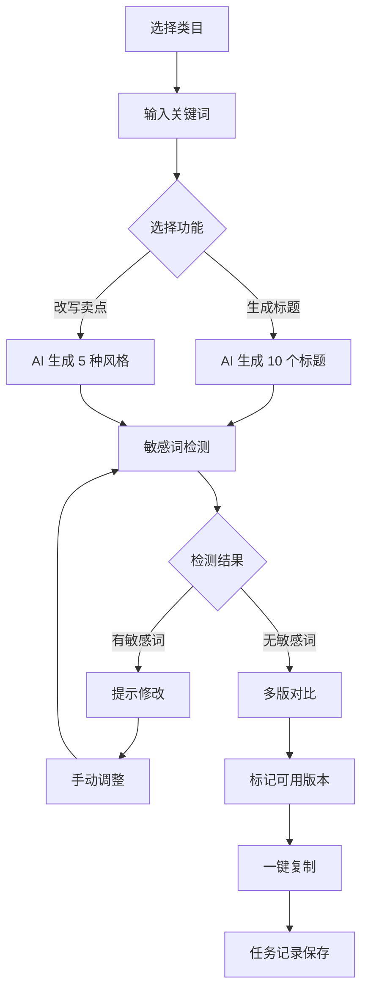
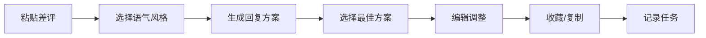

# AI 工具箱 - 电商店铺运营效率神器

## 1. 产品概述

AI 工具箱是一款专为电商店铺运营人员打造的智能工作台，帮助团队在商品上新、客服响应、活动策划等高频场景中快速调用 AI 能力，提升运营效率。

**核心价值：**
- **效率提升**：将重复性文案工作从 10 分钟缩短到 1 分钟
- **质量保障**：内置敏感词检测和话术合规检查
- **团队协同**：主管可查看团队使用数据，优化资源配置

**目标用户：**
- 电商店铺运营专员（上新、写文案、处理差评）
- 客服团队（快速生成回复话术）
- 活动策划人员（生成活动短信、海报文案）
- 运营主管（查看团队使用数据，评估 AI 工具价值）

## 2. 核心功能

### 2.1 用户角色

| 角色 | 说明 | 核心权限 |
|------|------|----------|
| 运营专员 | 使用 AI 工具生成文案和处理任务 | 使用全部 AI 功能、管理个人历史任务、收藏模板 |
| 运营主管 | 查看团队数据和管理品牌语气 | 查看团队使用记录、管理团队品牌语气库、查看统计报表 |

### 2.2 页面结构

#### 2.2.1 场景首页
- **快速入口区**：展示 6 大核心场景入口（商品上新、客服话术、活动短信、差评回复、竞品分析、图片处理）
- **本周统计卡片**：显示本周使用次数、成功生成次数、使用峰值时段
- **常用功能区**：展示个人最常用的 3 个功能快捷入口
- **最新任务区**：展示最近 5 条处理记录快速预览

#### 2.2.2 商品文案页
- **类目选择器**：支持选择商品类目（服装、数码、美妆、食品、家居等）
- **标题生成器**：输入关键词，一键生成 10 个标题备选
- **卖点改写器**：粘贴原始卖点，批量生成 5 种不同风格版本
- **敏感词检测**：自动扫描文案中的违规词、极限词、虚假宣传语
- **多版对比**：并排展示多个版本，支持标记可用版本
- **一键复制**：复制选定文案到剪贴板，支持带格式复制

#### 2.2.3 客服话术页
- **差评回复生成**：粘贴差评内容，自动生成多种回复方案
- **高频问题库**：预设常见问题模板，支持自定义添加
- **语气风格选择**：专业亲切、幽默风趣、严肃正式等风格切换
- **品牌语气保存**：保存团队常用的话术风格和禁用词库
- **历史话术管理**：收藏常用回复模板，支持分类管理

#### 2.2.4 活动短信页
- **活动类型选择**：节日促销、新品首发、会员专享、清仓处理
- **短信模板生成**：输入活动信息（时间、力度、链接），生成完整短信文案
- **字符计数**：实时显示短信字数，预估短信费用
- **多版本输出**：生成 3 种不同长度的短信版本（短报式、详情式、优惠强调式）
- **平台适配**：根据不同电商平台（淘宝、京东、拼多多）优化文案风格

#### 2.2.5 图片处理页
- **竞品分析**：上传竞品图片，提取文字信息和视觉元素
- **卖点提取**：从商品主图中识别并提取核心卖点
- **水印处理**：智能识别并移除图片水印（需授权）
- **批量标注**：为多张图片添加统一的卖点标注

#### 2.2.6 历史任务页
- **任务列表**：展示所有 AI 生成任务，支持筛选（时间、类型、状态）
- **任务详情**：查看每次生成的具体输入和输出内容
- **批量操作**：支持批量复制、批量删除、批量导出
- **收藏管理**：将常用结果收藏到个人模板库
- **任务统计**：按日/周/月统计任务数量和成功率

#### 2.2.7 账号中心
- **个人设置**：修改昵称、头像、密码
- **品牌语气库**：管理团队共享的品牌语气规则和禁用词库
- **模板收藏**：收藏高转化率的文案模板，支持标签分类
- **使用统计**：个人使用数据的详细报表
- **团队管理**（主管角色）：添加/移除团队成员、设置成员权限、查看团队整体使用数据

### 2.3 核心功能详情

#### 2.3.1 AI 生成功能
1. **选择商品类目生成标题**
   - 输入：商品关键词、类目
   - 输出：10 个优化后的标题备选
   - 特色：自动包含热搜词、避免重复度高标题

2. **批量改写卖点**
   - 输入：原始卖点文案
   - 输出：5 种不同风格的卖点版本
   - 特色：保留核心信息、改变表达方式

3. **生成活动短信**
   - 输入：活动类型、时间、优惠力度
   - 输出：3 种长度的短信文案
   - 特色：字符数控制、平台适配

4. **整理差评回复**
   - 输入：差评内容
   - 输出：多种回复方案
   - 特色：语气可调、包含安抚+解决策略

5. **提取竞品要点**
   - 输入：竞品商品链接或截图
   - 输出：竞品核心卖点、定价策略、营销手段分析
   - 特色：结构化输出、易于对比

#### 2.3.2 辅助功能
1. **保存常用品牌语气**
   - 功能：定义品牌调性、禁用词列表、常用表达句式
   - 应用：生成内容时自动遵循品牌语气

2. **对比多版输出**
   - 功能：并排展示多个版本，支持版本间差异高亮
   - 操作：支持标记选中、添加备注

3. **标记可用结果**
   - 功能：标记生成结果为"可用/待优化/废弃"
   - 统计：计算各版本的采纳率

4. **一键复制到平台**
   - 功能：复制内容到剪贴板，支持带格式复制
   - 特色：自动去除敏感词、添加必要的分隔符

5. **统计本周使用次数**
   - 功能：统计本周各功能的使用次数、处理成功率
   - 展示：卡片展示 + 趋势图表

6. **收藏高转化模板**
   - 功能：将高转化的文案模板收藏到个人库
   - 管理：支持标签、分类、搜索

7. **提醒敏感词风险**
   - 功能：扫描文案中的敏感词、极限词、违禁词
   - 提示：标红显示 + 修改建议

8. **主管查看团队使用记录**
   - 功能：查看团队所有成员的使用情况
   - 报表：使用次数统计、功能使用分布、成功率分析

## 3. 核心流程

### 3.1 商品文案生成流程

### 3.2 差评回复流程

## 4. 用户界面设计

### 4.1 设计风格

**视觉定位：科技感 + 专业高效 + 清新舒适**

**配色方案：**
- 主色调：#4F46E5（靛蓝色，代表专业和信任）
- 辅助色：#10B981（翠绿色，代表效率和成功）
- 警示色：#EF4444（红色，用于敏感词提示）
- 背景色：#F9FAFB（浅灰色，打造清爽工作区）
- 文字色：#111827（深灰色，确保可读性）

**按钮风格：**
- 主要按钮：圆角矩形，渐变背景，悬停放大效果
- 次要按钮：线条边框，透明背景
- 图标按钮：圆形或方形，简洁线条风格

**字体方案：**
- 标题字体：思源黑体（Source Han Sans CN） Bold
- 正文字体：思源黑体（Source Han Sans CN） Regular
- 数字/代码：等宽字体（JetBrains Mono）

**布局风格：**
- 左侧固定导航栏（宽 240px）
- 顶部工具栏（搜索、通知、个人中心）
- 主内容区采用卡片式布局
- 响应式设计，适配不同屏幕尺寸

**动效设计：**
- 页面切换：淡入淡出 + 轻微上移（300ms）
- 按钮悬停：背景渐变 + 轻微放大（150ms）
- 卡片加载：骨架屏动画
- 生成中：优雅的加载动画和进度指示

### 4.2 页面设计概览

#### 场景首页
- **布局**：左侧 2/3 为功能入口网格，右侧 1/3 为统计信息
- **功能入口**：6 个大卡片，图标 + 标题 + 描述
- **统计卡片**：渐变背景，数据可视化
- **最新任务**：时间线样式展示

#### 商品文案页
- **布局**：左侧输入区，右侧输出预览
- **输入区**：类目选择器 + 关键词输入框 + 功能选择标签
- **输出区**：Tab 切换不同版本，支持对比模式
- **操作区**：复制、收藏、标记按钮组

#### 客服话术页
- **布局**：顶部筛选区，下方为话术卡片列表
- **话术卡片**：差评内容 + AI 回复 + 操作按钮
- **收藏库**：侧边抽屉展示收藏的话术

#### 活动短信页
- **布局**：表单式布局，实时预览短信效果
- **输入表单**：活动类型、时间、优惠信息
- **预览区**：手机模拟框显示短信效果
- **字符统计**：实时计数 + 费用预估

#### 图片处理页
- **布局**：拖拽上传区 + 图片预览区 + 结果展示区
- **上传区**：支持拖拽 + 点击上传
- **处理结果**：文字提取结果 + 卖点标注

#### 历史任务页
- **布局**：筛选工具栏 + 任务列表 + 分页
- **任务卡片**：时间戳 + 任务类型 + 预览 + 操作
- **统计图表**：折线图展示趋势

#### 账号中心
- **布局**：左侧菜单 + 右侧内容区
- **个人设置**：表单式编辑
- **数据报表**：图表 + 数字卡片
- **团队管理**：表格 + 操作按钮

### 4.3 响应式策略

- **桌面优先**（1200px+）：完整功能展示
- **平板适配**（768px-1199px）：导航折叠，功能入口缩小
- **手机适配**（< 768px）：底部导航，功能简化展示

## 5. 数据存储

### 5.1 本地存储
- 用户偏好设置
- 品牌语气库
- 收藏模板
- 历史任务记录（最近 100 条）

### 5.2 团队共享数据
- 团队成员信息
- 共享品牌语气规则
- 团队使用统计数据

## 6. 成功指标

- **功能覆盖率**：100% 的需求场景都能在工具箱中找到对应功能
- **使用频率**：运营人员日均使用 10+ 次
- **效率提升**：文案生成时间减少 70%
- **采纳率**：生成内容被采纳率 > 60%
- **敏感词拦截**：100% 拦截明显的敏感词问题
