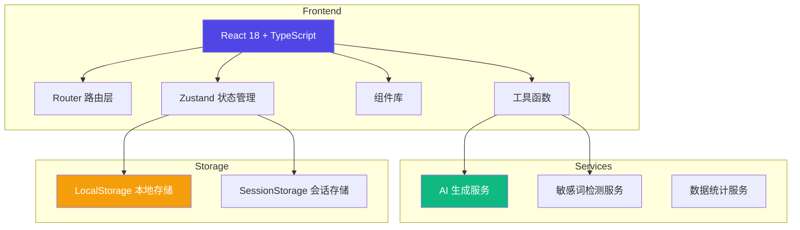

# AI 工具箱 - 技术架构文档

## 1. 架构设计



## 2. 技术选型

### 2.1 前端技术栈

- **框架**：React 18.2+ with TypeScript
- **构建工具**：Vite 5.0+
- **路由管理**：React Router DOM 6.x
- **状态管理**：Zustand 4.x
- **样式方案**：Tailwind CSS 3.4+
- **图标库**：Lucide React
- **图表库**：Recharts（用于数据可视化）
- **UI 组件**：自定义组件库 + Radix UI 基础组件
- **拖拽上传**：react-dropzone
- **复制功能**：react-copy-to-clipboard

### 2.2 开发工具

- **包管理器**：pnpm（优先）或 npm
- **代码规范**：ESLint + Prettier
- **类型检查**：TypeScript strict mode
- **Git Hooks**：Husky

## 3. 路由定义

| 路由路径 | 页面名称 | 功能描述 |
|---------|---------|---------|
| `/` | 场景首页 | 快速入口、统计概览、最新任务 |
| `/product` | 商品文案页 | 标题生成、卖点改写、敏感词检测 |
| `/service` | 客服话术页 | 差评回复、高频问题库、话术管理 |
| `/sms` | 活动短信页 | 活动短信生成、字符统计 |
| `/image` | 图片处理页 | 竞品分析、卖点提取、图片标注 |
| `/history` | 历史任务页 | 任务列表、批量操作、收藏管理 |
| `/account` | 账号中心 | 个人设置、品牌语气库、团队管理 |
| `/account/team` | 团队管理 | 成员管理、使用数据查看 |

## 4. 目录结构

```
ai-toolbox/
├── src/
│   ├── components/          # 可复用组件
│   │   ├── common/          # 通用组件（按钮、输入框、卡片等）
│   │   ├── layout/          # 布局组件（导航栏、侧边栏等）
│   │   └── features/        # 功能组件（敏感词检测、版本对比等）
│   ├── pages/               # 页面组件
│   │   ├── Home/           # 场景首页
│   │   ├── Product/         # 商品文案页
│   │   ├── Service/         # 客服话术页
│   │   ├── Sms/             # 活动短信页
│   │   ├── Image/           # 图片处理页
│   │   ├── History/         # 历史任务页
│   │   └── Account/         # 账号中心
│   ├── hooks/               # 自定义 Hooks
│   │   ├── useTask.ts      # 任务管理 Hook
│   │   ├── useCopy.ts       # 复制功能 Hook
│   │   ├── useStats.ts      # 统计功能 Hook
│   │   └── useBrandTone.ts  # 品牌语气 Hook
│   ├── stores/              # Zustand 状态库
│   │   ├── taskStore.ts     # 任务状态
│   │   ├── userStore.ts     # 用户状态
│   │   └── statsStore.ts    # 统计数据状态
│   ├── services/            # 业务服务
│   │   ├── aiService.ts     # AI 生成服务
│   │   ├── sensitiveService.ts  # 敏感词检测
│   │   └── storageService.ts    # 存储服务
│   ├── utils/               # 工具函数
│   │   ├── copy.ts          # 复制工具
│   │   ├── sensitive.ts     # 敏感词库
│   │   └── formatters.ts    # 格式化工具
│   ├── types/               # TypeScript 类型定义
│   │   └── index.ts         # 全局类型
│   ├── App.tsx              # 根组件
│   ├── main.tsx             # 入口文件
│   └── index.css            # 全局样式
├── public/                  # 静态资源
├── package.json
├── tsconfig.json
├── vite.config.ts
├── tailwind.config.js
├── .eslintrc.js
└── README.md
```

## 5. 数据模型

### 5.1 任务记录 (Task)

```typescript
interface Task {
  id: string;
  type: 'title' | 'selling_point' | 'sms' | 'review_reply' | 'competitor_analysis';
  input: string;
  outputs: Output[];
  selectedIndex: number;
  status: 'pending' | 'completed' | 'failed';
  createdAt: Date;
  updatedAt: Date;
  tags?: string[];
  notes?: string;
}

interface Output {
  content: string;
  version: string;
  sensitiveWords: string[];
  isMarked: boolean;
  markStatus: 'available' | 'pending' | 'rejected';
}
```

### 5.2 品牌语气 (BrandTone)

```typescript
interface BrandTone {
  id: string;
  name: string;
  description: string;
  style: 'professional' | 'friendly' | 'humorous' | 'formal';
  forbiddenWords: string[];
  commonPhrases: string[];
  createdBy: string;
  createdAt: Date;
  isTeamShared: boolean;
}
```

### 5.3 使用统计 (UsageStats)

```typescript
interface UsageStats {
  date: string;
  taskType: string;
  count: number;
  successCount: number;
  userId: string;
}
```

### 5.4 用户信息 (User)

```typescript
interface User {
  id: string;
  name: string;
  email: string;
  role: 'member' | 'supervisor';
  teamId?: string;
  avatar?: string;
  createdAt: Date;
}
```

### 5.5 收藏模板 (Template)

```typescript
interface Template {
  id: string;
  name: string;
  type: string;
  content: string;
  tags: string[];
  usageCount: number;
  conversionRate?: number;
  createdAt: Date;
  userId: string;
}
```

## 6. 核心服务

### 6.1 AI 生成服务

```typescript
// AI 服务接口
interface AIService {
  generateTitles(keywords: string, category: string): Promise<string[]>;
  rewriteSellingPoints(text: string, style: string): Promise<string[]>;
  generateSms(params: SmsParams): Promise<SmsResult[]>;
  generateReviewReply(review: string, tone: string): Promise<string[]>;
  extractCompetitorInfo(imageUrl: string): Promise<CompetitorInfo>;
}
```

### 6.2 敏感词检测服务

```typescript
// 敏感词检测接口
interface SensitiveService {
  check(text: string): SensitiveCheckResult;
  getSuggestions(word: string): string[];
}

interface SensitiveCheckResult {
  hasRisk: boolean;
  words: SensitiveWord[];
  suggestions: string[];
}

interface SensitiveWord {
  word: string;
  type: 'forbidden' | 'extreme' | 'false_claim';
  position: number;
}
```

### 6.3 存储服务

```typescript
// 本地存储服务
interface StorageService {
  saveTasks(tasks: Task[]): void;
  loadTasks(): Task[];
  saveBrandTones(tones: BrandTone[]): void;
  loadBrandTones(): BrandTone[];
  saveTemplates(templates: Template[]): void;
  loadTemplates(): Template[];
  saveStats(stats: UsageStats[]): void;
  loadStats(dateRange: DateRange): UsageStats[];
  saveUser(user: User): void;
  loadUser(): User | null;
}
```

## 7. 状态管理

### 7.1 任务状态 (taskStore)

```typescript
interface TaskState {
  tasks: Task[];
  currentTask: Task | null;
  addTask: (task: Task) => void;
  updateTask: (id: string, updates: Partial<Task>) => void;
  deleteTask: (id: string) => void;
  setCurrentTask: (task: Task | null) => void;
  loadTasks: () => void;
}
```

### 7.2 用户状态 (userStore)

```typescript
interface UserState {
  user: User | null;
  brandTones: BrandTone[];
  templates: Template[];
  setUser: (user: User) => void;
  addBrandTone: (tone: BrandTone) => void;
  addTemplate: (template: Template) => void;
  loadUserData: () => void;
}
```

### 7.3 统计状态 (statsStore)

```typescript
interface StatsState {
  weeklyStats: UsageStats[];
  totalCount: number;
  successRate: number;
  topFunctions: { name: string; count: number }[];
  updateStats: (stats: UsageStats) => void;
  loadWeeklyStats: () => void;
}
```

## 8. 关键组件

### 8.1 布局组件

| 组件名称 | 说明 |
|---------|------|
| AppLayout | 主布局容器，包含侧边栏和内容区 |
| Sidebar | 左侧导航栏，包含 Logo、导航菜单、用户信息 |
| TopBar | 顶部工具栏，包含搜索框、通知、个人中心 |
| PageHeader | 页面标题区，包含标题、面包屑、操作按钮 |

### 8.2 功能组件

| 组件名称 | 说明 |
|---------|------|
| TaskCard | 任务卡片，展示任务信息和操作按钮 |
| OutputCompare | 多版本对比组件，并排展示不同版本 |
| SensitiveHighlight | 敏感词高亮组件，标红敏感词 |
| CopyButton | 复制按钮，支持一键复制到剪贴板 |
| TagSelector | 标签选择器，用于标记和分类 |
| StatsChart | 统计图表组件，展示使用数据 |
| FileUploader | 文件上传组件，支持拖拽上传 |

### 8.3 表单组件

| 组件名称 | 说明 |
|---------|------|
| CategorySelect | 商品类目选择器 |
| KeywordInput | 关键词输入框，支持多标签输入 |
| ToneSelector | 语气风格选择器 |
| TemplateEditor | 模板编辑器，支持富文本编辑 |

## 9. Mock 数据策略

由于本应用为前端演示项目，将采用以下 Mock 数据策略：

### 9.1 AI 生成功能 Mock
- 使用预设的文案模板库
- 根据输入关键词随机组合生成结果
- 添加随机延迟模拟真实 AI 响应时间（500-1500ms）

### 9.2 敏感词检测 Mock
- 内置常用敏感词库（100+ 词汇）
- 支持自定义添加敏感词
- 提供智能替换建议

### 9.3 数据存储 Mock
- 使用 LocalStorage 模拟持久化存储
- 预置示例任务数据和模板
- 支持数据导入导出（JSON 格式）

## 10. 性能优化

### 10.1 组件优化
- 使用 `React.memo` 优化重渲染
- 使用 `useMemo` 和 `useCallback` 减少计算
- 懒加载非首屏组件

### 10.2 状态管理优化
- 拆分状态到多个 store，减少不必要的重渲染
- 使用 Zustand 的 selector 优化订阅
- 批量更新状态，减少重渲染次数

### 10.3 加载优化
- 骨架屏加载
- 图片懒加载
- 代码分割

## 11. 可访问性 (Accessibility)

- 所有交互元素支持键盘操作
- 适当的 ARIA 标签
- 颜色对比度符合 WCAG 2.1 AA 标准
- 支持屏幕阅读器
- 焦点管理优化

## 12. 浏览器兼容

- Chrome 90+
- Firefox 88+
- Safari 14+
- Edge 90+
